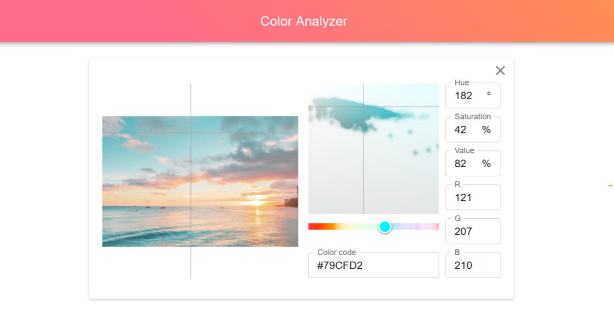

# color-analyzer



An image color picker histogram visualizer.

Effortlessly analyze and visualize the colors in your images with a histogram on a color picker. Gain valuable insights into the color composition. Explore the dynamic color spectrum instantly.

## How to Run

```bash
cd web
npm run dev
```

## How to Deploy

```bash
cd web
npm run build

# commit changes to trigger deployment action
```
